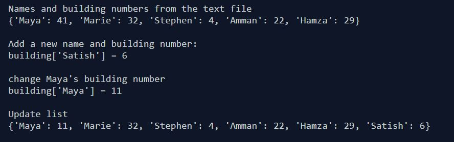

# Building Numbers
Wrote a program that keeps track of who works in what building. Each person will be identified by their first name, and each building will be identified by a number. This information will be stored in a dictionary while the program is running and kept in a file when the program is not running. 

 

  

